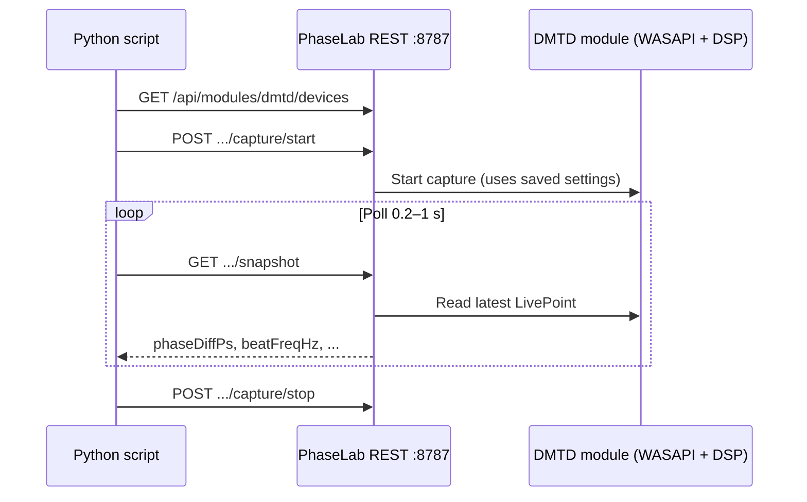

# DMTD phase / delay — Python integration guide

Use this document as context for a Cursor agent (or any script) that should read **live differential phase** from PhaseLab’s DMTD module over the **localhost REST API**.

PhaseLab must be **running on Windows** with the API enabled. Measurement DSP runs inside the app; Python only polls JSON and optionally starts/stops capture.

**Related docs:** [REST API reference](API.md) · Swagger UI: `http://127.0.0.1:8787/docs` · OpenAPI: `http://127.0.0.1:8787/openapi/v1.json`

---

## Prerequisites

| Requirement | Notes |
|-------------|--------|
| PhaseLab desktop app | Built from this repo or installed from [GitHub Releases](https://github.com/SarunasStraigis/DMTD/releases) |
| `apiEnabled: true` | `%AppData%\PhaseLab\settings.json` (default port **8787**) |
| DMTD configured in UI | Device, sample rate, beat frequency, ref frequency, block duration — saved to `%AppData%\PhaseLab\Dmtd\settings.json` |
| Audio path | Windows Sound sample rate should match the rate selected in PhaseLab (orange warning if not) |

The REST API does **not** expose every DMTD setting (e.g. `refFrequency`, `beatFrequency`, IQ options). Set those in the PhaseLab UI (or edit `Dmtd\settings.json` while the app is closed), then start capture via API or UI.

---

## Integration model



**Module id:** `dmtd`  
**Primary endpoint:** `GET /api/modules/dmtd/snapshot`

---

## Metrics you care about

Snapshot envelope (all modules):

```json
{
  "moduleId": "dmtd",
  "timestamp": "2026-05-29T12:00:00.0000000+00:00",
  "capturing": true,
  "statusText": "Capturing at 192000 Hz",
  "data": { }
}
```

DMTD `data` fields (JSON uses **camelCase**):

| Field | Type | Meaning |
|-------|------|---------|
| `phaseDiffPs` | number \| null | **Main output:** A−B differential phase in picoseconds (after phase-zero offset, wrapped to one cycle at ref frequency) |
| `phaseDiffRad` | number \| null | Same phase in radians, principal value (−π, π] |
| `beatFreqHz` | number \| null | Estimated beat frequency (Hz) for this block |
| `movingAveragePs` | number \| null | Session moving average of `phaseDiffPs` history |
| `stdDevPs` | number \| null | Session standard deviation (ps) |
| `maWindow` | int | Moving-average window size (points) |
| `phaseZeroActive` | bool | User “Set Zero” offset applied |
| `phaseZeroOffsetPs` | number | Stored zero offset (ps) |
| `rmsA`, `rmsB` | number \| null | Per-channel RMS (full scale 0–1) |
| `slipCount` | int | Cumulative 2π unwrap slip events |
| `latestTimestamp` | string \| null | ISO 8601 time of last DSP block |

When not capturing or before the first block, `phaseDiffPs` / `phaseDiffRad` are `null` but envelope fields still update.

### Phase ↔ time delay

Inside PhaseLab, picoseconds are defined at the **reference frequency** `f_ref` (default 90 MHz, from DMTD settings):

```text
ps_per_rad = 1e12 / (2π × f_ref)
phase_diff_ps = phase_diff_rad × ps_per_rad
```

**Equivalent delay in seconds** (what many automation scripts want):

```python
delay_seconds = phase_diff_ps * 1e-12
# equivalently: phase_diff_rad / (2 * math.pi * f_ref_hz)
```

Use the same `f_ref_hz` as in `%AppData%\PhaseLab\Dmtd\settings.json` (`refFrequency`). The API does not return `refFrequency` in the snapshot; read it once from config or hard-code your lab value.

**Beat frequency** (`beatFreqHz`) is the down-converted tone used for IQ demodulation; expansion to ref-frequency phase is already applied in `phaseDiffPs`.

### Polling rate

- DSP produces one point per **block** (`blockDurationMs` in settings, often 1000 ms).
- Polling **0.2–1 s** is enough; faster polling repeats the same sample until the next block.
- Suggested: **1 Hz** for logging, **5–10 Hz** if you only need “latest as soon as updated”.

---

## REST endpoints (DMTD)

Base URL: `http://127.0.0.1:8787` (or `apiPort` from shell settings).

| Method | Path | Purpose |
|--------|------|---------|
| GET | `/api` | App info, module ids |
| GET | `/api/modules/dmtd` | Capabilities and action ids |
| GET | `/api/modules/dmtd/status` | `capturing`, `deviceId`, `sampleRate`, `statusText` |
| GET | `/api/modules/dmtd/snapshot` | **Live metrics** (`data` above) |
| GET | `/api/modules/dmtd/devices` | `[{ "id", "name" }, ...]` |
| POST | `/api/modules/dmtd/devices/refresh` | Re-scan WASAPI devices |
| POST | `/api/modules/dmtd/capture/start` | Optional JSON body (below) |
| POST | `/api/modules/dmtd/capture/stop` | Stop capture |
| POST | `/api/modules/dmtd/actions/phase-zero-set` | Zero phase to current reading (capture must run) |
| POST | `/api/modules/dmtd/actions/phase-zero-clear` | Clear zero |
| POST | `/api/modules/dmtd/actions/session-reset` | Reset session stats / plot |

**Capture start body** (all optional):

```json
{
  "deviceId": "{WASAPI device id from /devices}",
  "sampleRate": 192000
}
```

Omit body to use the device and rate already selected in the UI. If capture fails, response is **409** with `{"detail": "..."}`.

---

## Minimal Python example (stdlib only)

```python
"""Poll DMTD phase from PhaseLab. Requires: PhaseLab running, apiEnabled=true."""

from __future__ import annotations

import json
import math
import time
import urllib.error
import urllib.request

BASE = "http://127.0.0.1:8787"
MODULE = "dmtd"

# Must match PhaseLab DMTD Configuration → Reference frequency (Hz)
REF_FREQUENCY_HZ = 90_000_000.0


def api(method: str, path: str, body: dict | None = None) -> dict:
    url = f"{BASE}{path}"
    data = None if body is None else json.dumps(body).encode("utf-8")
    req = urllib.request.Request(
        url,
        data=data,
        method=method,
        headers={"Content-Type": "application/json"} if body else {},
    )
    try:
        with urllib.request.urlopen(req, timeout=5) as resp:
            return json.load(resp)
    except urllib.error.HTTPError as e:
        detail = e.read().decode()
        raise RuntimeError(f"{method} {path} -> {e.code}: {detail}") from e


def list_input_devices() -> list[dict]:
    return api("GET", f"/api/modules/{MODULE}/devices")


def start_capture(device_id: str | None = None, sample_rate: int | None = None) -> None:
    body = {}
    if device_id:
        body["deviceId"] = device_id
    if sample_rate:
        body["sampleRate"] = sample_rate
    api("POST", f"/api/modules/{MODULE}/capture/start", body or None)


def stop_capture() -> None:
    api("POST", f"/api/modules/{MODULE}/capture/stop")


def get_snapshot() -> dict:
    return api("GET", f"/api/modules/{MODULE}/snapshot")


def phase_to_delay_seconds(phase_diff_ps: float) -> float:
    return phase_diff_ps * 1e-12


def main() -> None:
    print("Devices:", list_input_devices())

    # Example: start at 192 kHz using UI-selected device
    start_capture(sample_rate=192_000)
    time.sleep(0.5)

    try:
        for _ in range(30):
            snap = get_snapshot()
            if not snap.get("capturing"):
                print("Not capturing:", snap.get("statusText"))
                break

            d = snap.get("data") or {}
            ps = d.get("phaseDiffPs")
            if ps is None:
                print("Waiting for first block...", snap.get("statusText"))
            else:
                delay_s = phase_to_delay_seconds(ps)
                beat = d.get("beatFreqHz")
                print(
                    f"phase={ps:+.3f} ps  delay={delay_s*1e9:+.3f} ns  "
                    f"beat={beat} Hz  MA={d.get('movingAveragePs')} ps  "
                    f"std={d.get('stdDevPs')} ps"
                )
            time.sleep(1.0)
    finally:
        stop_capture()


if __name__ == "__main__":
    main()
```

---

## Example with `requests` (optional dependency)

```python
import requests

BASE = "http://127.0.0.1:8787"
s = requests.Session()

def snapshot():
    r = s.get(f"{BASE}/api/modules/dmtd/snapshot", timeout=5)
    r.raise_for_status()
    return r.json()

s.post(f"{BASE}/api/modules/dmtd/capture/start", json={"sampleRate": 192000}).raise_for_status()
try:
    while True:
        snap = snapshot()
        ps = (snap.get("data") or {}).get("phaseDiffPs")
        if ps is not None:
            print(ps, "ps")
        time.sleep(0.5)
except KeyboardInterrupt:
    pass
finally:
    s.post(f"{BASE}/api/modules/dmtd/capture/stop", timeout=5)
```

---

## Typical automation workflow

1. Start PhaseLab; confirm `GET http://127.0.0.1:8787/api` returns module id `dmtd`.
2. In UI (once): pick input device, sample rate, ref/beat frequency, block duration; **Save Configuration**.
3. Python: `GET /devices` → optional `POST /capture/start` with `deviceId` / `sampleRate`.
4. Loop `GET /snapshot` until `data.phaseDiffPs` is non-null.
5. Optional: `POST .../actions/phase-zero-set` to define “0 ps” at a reference alignment.
6. Use `phaseDiffPs` or convert to `delay_seconds`; use `movingAveragePs` / `stdDevPs` for stability checks.
7. `POST /capture/stop` when done.

---

## Error handling

| HTTP | Meaning |
|------|---------|
| Connection refused | PhaseLab not running or `apiEnabled: false` |
| 404 | Wrong module id or device id |
| 409 | Precondition failed (e.g. capture already running, no device, invalid sample rate) — read `detail` |
| 503 | UI thread unavailable (rare; retry) |

Always check `capturing` and `statusText` in the snapshot; they explain rate mismatch warnings and device issues.

---

## What the API does *not* do

- **No raw audio export** over REST (only derived metrics).
- **No batch/history API** in v1 (history is stored locally in `history.db`; not exposed via HTTP).
- **No headless DSP** — you cannot call `DmtdProcessor` from Python without PhaseLab running; for offline replay use golden vectors / `Dmtd.Core` from .NET tests, not this API.

---

## Settings file reference (for agents)

`%AppData%\PhaseLab\settings.json` — shell / API:

```json
{ "apiEnabled": true, "apiPort": 8787, "activeModeId": "dmtd" }
```

`%AppData%\PhaseLab\Dmtd\settings.json` — DMTD DSP (camelCase JSON):

| Field | Role |
|-------|------|
| `sampleRate` | Requested capture rate (Hz) |
| `blockDurationMs` | Block length → update rate of new `phaseDiffPs` |
| `beatFrequency` | Nominal beat (Hz); used when estimator is `fixed` |
| `refFrequency` | Converts rad ↔ ps (`phaseDiffPs` scale) |
| `freqEstimator` | `fftPeak` or `fixed` |
| `freqSource` | `chA` or `avgAb` |
| `phaseZeroOffsetPs` | Persisted zero offset |

---

## Copy-paste prompt for another Cursor agent

```text
Integrate DMTD phase/delay measurement from PhaseLab into my Python script.

- Read docs/DMTD_PYTHON_INTEGRATION.md and docs/API.md in the PhaseLab (DMTD) repo.
- Use localhost REST: GET /api/modules/dmtd/snapshot for phaseDiffPs (picoseconds at ref frequency).
- Convert to delay: delay_seconds = phaseDiffPs * 1e-12 with refFrequency from %AppData%/PhaseLab/Dmtd/settings.json.
- PhaseLab must be running on Windows with apiEnabled true (default port 8787).
- Poll ~1 Hz; start/stop via POST .../capture/start and .../capture/stop.
- Handle 409 errors via JSON "detail". Do not assume raw audio or offline DSP via HTTP.
```

---

## Version

Written for PhaseLab **v1.0.6+** (localhost module API). If OpenAPI and this doc disagree, prefer the running server’s `/openapi/v1.json`.
